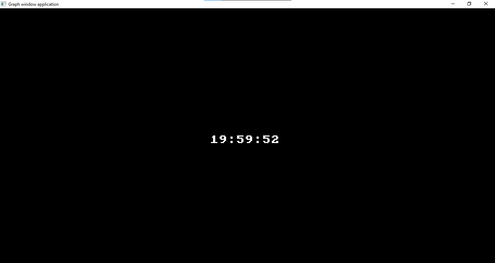

# Real-Time Clock in Pascal

## Overview

This Pascal program displays a real-time clock with hours, minutes, and seconds. It utilizes the `graph` unit for graphical output and the `dos` unit for time-related functions.

## Features

-   Real-time clock display.
-   Updates every second.
-   Minimalist graphical user interface.

## Getting Started

### Prerequisites

Before running the program, ensure that you have a Pascal compiler that supports the `graph` and `dos` units.

### Usage

1. Copy the program code into your Pascal environment.
2. Compile and run the program.

## Program Structure

The program is structured as follows:

-   `hodnota0`: Function for formatting a numerical value to always have at least two digits.
-   `cas`: Function for formatting the time in hours, minutes, and seconds.
-   Main loop: Displays the real-time clock and updates every second.

## Screenshots

## Contributing

Contributions are welcome! If you have any ideas for improvement, feel free to open an issue or create a pull request.

## License

This project is licensed under the MIT License - see the [LICENSE](LICENSE) file for details.
